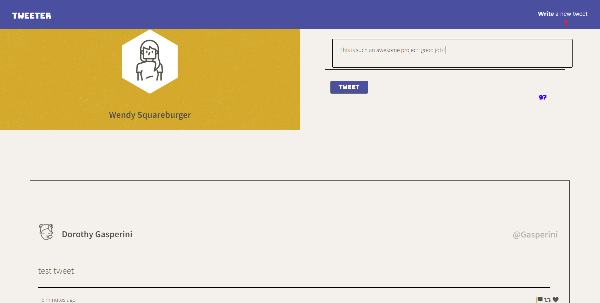

# Tweeter Project

Tweeter is a simple, single-page Twitter clone.

This project was created using HTML, CSS, Sass, JS, jQuery and AJAX front-end skills, and Node, Express back-end skills. The project is adapts to responsive design for various screen sizes.

## Setup

1. Clone your repository onto your local device.
3. Install dependencies using the `npm install` command.
3. Start the web server using the `npm run local` command. The app will be served at <http://localhost:8080/>.
4. Go to <http://localhost:8080/> in your browser.

## Dependencies

- Express 
- Node 5.10.x or above
- Body-parser 1.15.2 or above (included in packageJSON)
- Chance 1.0.2 or above (included in packageJSON)
- md5 2.1.0 or above (included in packageJSON)
- Sass 1.44.0 or above (included in packageJSON)
- timeago.js 4.0.2 (included in packageJSON)

## This is the Desktop layout of the project (mid tweet)

## Responsive Tweets without re-rendering

## Mobile friendly viewing 

## Mobile load screen
